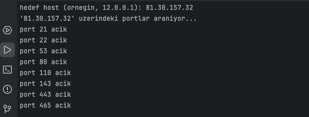

# go-host-scanner

## installing

```bash 
git clone https://github.com/mefistofeles00/go-host-scanner.git
cd host-scanner
cd hostscan
go run main.go
```
**_you can use and developed it this little project :)_**

### screenshots
 


## modules 

1. [x] servercan admin panel tool
2. server open ports informations (not yet)


